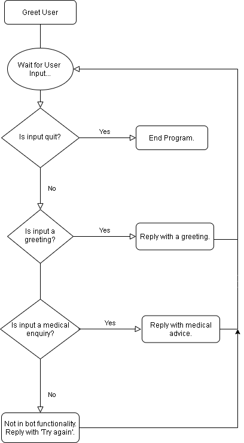
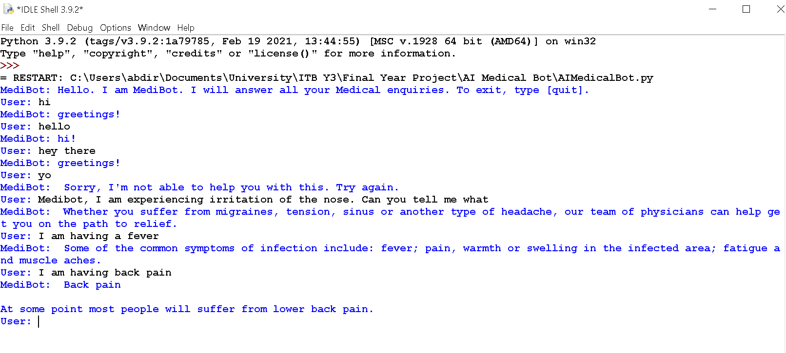

# AI-Medical-Chatbot
ITB Y3 Final Year Project

Artificial Intelligence Chatbot that is able to help patients diagnose their condition. The chatbot will use input from answers that the patient gives to diagnose the condition using the diagnostic data it has stored. For the project, I expect an output of a software which is able to take in user input and intelligently answer back.

The proposed software plan for the development of the artificial intelligence medical chatbot involves using the Python programming language. Specifically, the libraries that I will be using are NLTK, which stands for Natural Language Toolkit. This library is used by Python programs that need to work with human language data. The other important library I will use is the newspaper3k library, which is a web scraping library. This will be used to scrape medical information from a website (Northshore: 2014) for the bot to use to conduct diagnostics and deliver information to the user. The finished bot should be able to reply intelligently to user greetings, be able to detect symptoms that the user has sent in their message and be able to correspond the symptoms to the correct illness in the medical website and respond with the appropriate diagnosis.

